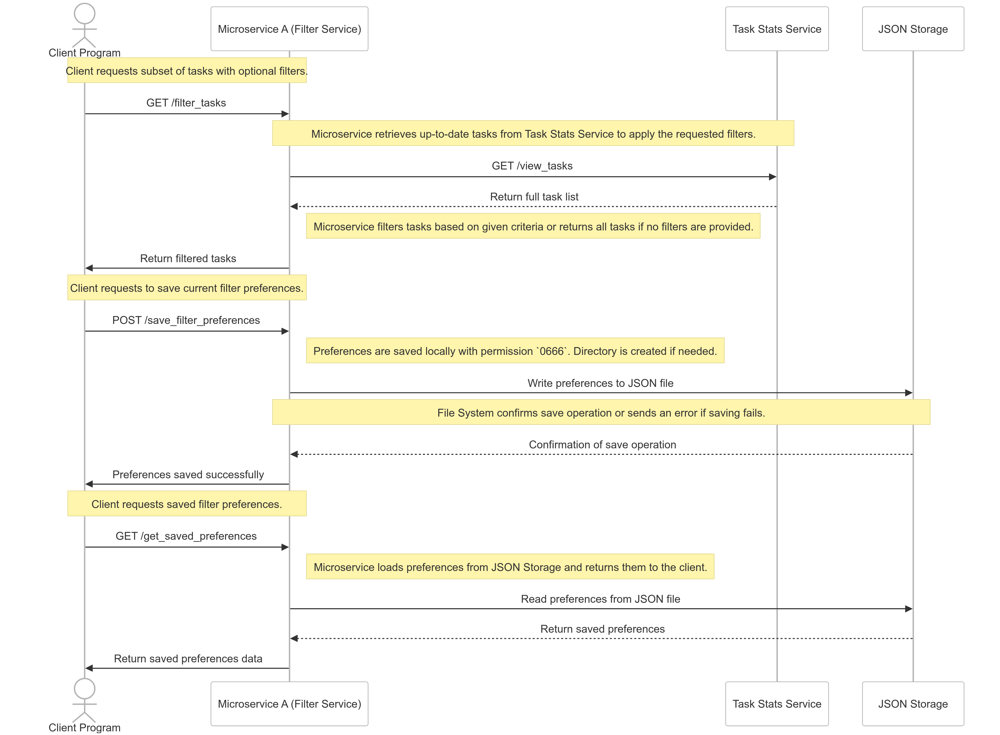

## Table of Contents

1. [Testing Microservice A](#testing-microservice-a)
2. [Task Filter Service Communication Contract](#task-filter-service-communication-contract)


## Testing Microservice A

To run docker:

```bash
docker-compose up --build
```

### Test Cases Overview

#### 1. Service Validation
- **Purpose:** Ensure both services are running and accessible.
- **Endpoints Tested:**
  - `GET /filter_tasks` (Task Filter Service)

#### 2. Setting Up Test Data
- **Purpose:** Create test tasks to validate filtering capabilities.
- **Tasks Created:**
  - High Priority Complete Task
  - High Priority Pending Task  
  - Low Priority Pending Task

#### 3. Testing Filter Tasks Endpoint
- **Purpose:** Validate the filtering functionality based on different criteria.
- **Test Cases:**
  - Filter by Priority (High): Should return 2 high-priority tasks.
  - Filter Completed Tasks: Should return 1 completed task.
  - Filter by Due Date (Today): Should return 2 tasks due today.

#### 4. Testing Preferences Endpoints
- **Purpose:** Verify saving, retrieving, and clearing filter preferences.
- **Test Cases:**
  - Save Preferences: Save filter settings successfully.
  - Get Saved Preferences: Retrieve saved preferences accurately.
  - Clear Preferences: Clear all saved preferences.

#### 5. Cleaning Up Test Data
- **Purpose:** Remove all test tasks created during the setup phase.
- **Process:** Retrieve and delete all test tasks.

### Running the Tests

1. Ensure Services are Running:
   ```bash
   docker-compose up --build
   ```


2. Run the Test Script:
   ```bash
   python testing_task_filter.py
   ```

3. Review the Output: The script will display the progress and results of each test case.

### Conclusion

The comprehensive testing of the **Task Filter Service** ensures that filtering functionalities and preference management operate as expected. While the **Task Stats Service** is used here for testing purposes, the Task Filter Service is designed to work with any compatible task data provider that implements the required REST API endpoints.

## Task Filter Service Communication Contract

### 1. Overview
The Task Filter Service provides a RESTful API endpoint that allows filtering of tasks based on various criteria such as priority, completion status, and due date. While our examples show integration with task_stats.py, the service is designed to work with any task data provider that implements the expected REST API contract.

### 2. Making Requests

The reason why the base URL is task_filter and not localhost:5003 is because the Task Filter Service is a microservice and it is intended to be run on a different machine than the Task Stats Service.

#### Base URL
```
http://localhost:5003
```
or
```
http://task_filter:5003
```

#### Endpoint
```
GET /filter_tasks
```

#### Query Parameters
| Parameter  | Type    | Values                | Description                    |
|-----------|---------|----------------------|--------------------------------|
| priority  | string  | low, medium, high    | Filter tasks by priority level |
| completed | boolean | true, false          | Filter by completion status    |
| due_date  | string  | YYYY-MM-DD           | Filter tasks by due date       |

#### Example Requests
```python
import requests

# Basic request - filter by priority
response = requests.get(
    "http://task_filter:5003/filter_tasks",
    params={"priority": "high"}
)

# Advanced request - multiple filters
response = requests.get(
    "http://task_filter:5003/filter_tasks",
    params={
        "priority": "high",
        "completed": "true",
        "due_date": "2024-03-20"
    }
)
```

### 3. Receiving Data

#### Success Response Format
```python
{
    "filtered_tasks": [
        {
            "id": "task-uuid",
            "title": "Task Title",
            "description": "Task Description",
            "priority": "high",
            "due_date": "2024-03-20",
            "completed": false,
            "created_at": "2024-03-19 10:30:00"
        },
        // ... more tasks
    ]
}
```

#### Example Usage
```python
response = requests.get("http://task_filter:5003/filter_tasks")
if response.ok:
    filtered_tasks = response.json()["filtered_tasks"]
    for task in filtered_tasks:
        print(f"Task: {task['title']}, Priority: {task['priority']}")
else:
    print(f"Error: {response.status_code}")
```

### 4. Error Handling

#### Status Codes
| Code | Description           | Cause                           |
|------|--------------------- |--------------------------------|
| 200  | Success              | Request processed successfully  |
| 400  | Bad Request          | Invalid parameter values        |
| 500  | Internal Server Error | Server-side processing error   |

#### Error Response Format
```python
{
    "error": "Description of what went wrong"
}
```

#### Example Error Handling
```python
response = requests.get(
    "http://task_filter:5003/filter_tasks",
    params={"priority": "invalid"}
)

if not response.ok:
    error = response.json().get("error", "Unknown error")
    print(f"Request failed: {error}")
```

### 5. UML Sequence Diagram

The UML sequence diagram is intended to be used as a reference for the communication between the Task Filter Service and the Task Stats Service. 




### 6. Implementation Notes

- All dates should be in ISO format (YYYY-MM-DD)
- Priority values are case-sensitive
- The service maintains its own filter preferences storage
- Requests are stateless - each request must include all needed parameters
- Response times may vary based on the total number of tasks